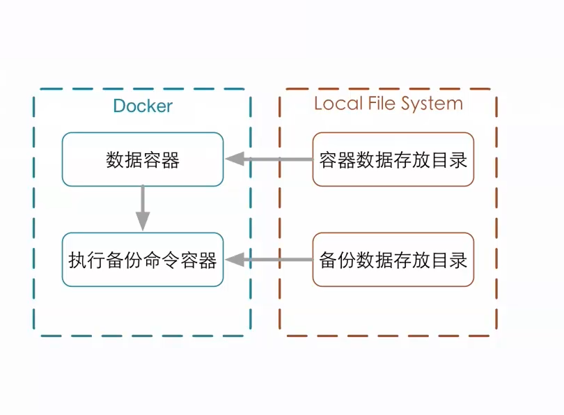

# 概要

* 容器的数据卷
* 数据卷容器
* 数据卷的备份还原

##数据卷的概念以及如何使用数据卷

什么是数据卷（Data Volume）
* 数据持久化
* 共享数据

> 数据卷是经过特殊设计的目录，可以绕过联合文件系统（UFS）, 为一个或多个容器提供共访问。
> 数据卷设计的目的*数据处久化*，他完全独立独与容器的生存周期，因此，Docker不回在容器
> 删除时删除其挂载的数据卷,也不会存在类似的垃圾回收机制，对容器引用的数据卷进行处理。


* 数据卷独立于docker的存在 存在docker宿主机(Host)中 与容器的生存周期分离
* 数据卷本质上书存在于宿主机的文件系统
* 数据卷可以是目录也可以是文件
* 容器可以利用数据卷技术与宿主机进行数据共享
* 同一个目录或文件可以支持多个容器的访问  也就是实现了容器间数据的交换


## 数据卷的特点
* 数据卷在容器启动时初始化，如果容器使用的镜像在挂载点包含了数据，这些数据会拷贝到新初始化的数据卷中
* 数据卷可以在容器之间共享和重用
* 可以对数据卷里的内容直接进行修改
* 数据卷的变化不会影响镜像的更新
* 卷会一直存在，即使挂载数据卷的容器已经被删除


##如何为容器添加数据卷
```docker run -v ~/container_data:/data -it ubuntu /bin/bash```
##如何为数据卷添加访问权限
```docker run -v ~/datavolume:/data:ro -it ubuntu /bin/bash```


```
# For Data Volume Test

FROM ubuntu:16:04
VOLUME ["/datavolume1","/datavolume2"]
CMD /bin/bash
```

## 数据卷容器
> 什么是数据卷容器
> 命令的容器挂载数据卷，其他容器通过挂载这个容器实现数据共享，挂载数据卷的容器，
> 就叫做数据卷容器


###挂载数据卷容器的方法
```
   docker run --volumes-from [CONTAINER NAME]
   docker run -it --name dvt5 --volumes-from dvt4 ubuntu /bin/bash
```
###数据卷容器的作用就是将数据卷容器的配置传递到要构建的容器


## 数据卷的备份还原
> 数据备份方法
> * ```docker run --volumes-from [container name] -v $(pwd):/backup ubuntu``` 
> * ```tar cvf /backup/backup.tar [container data volume]```

```
$ docker run --volumes-from dvt5 -v ~/backup:/backup --name dvt10 ubuntu tar cvf /backup/dvt5.tar /datavolume1
```
 

