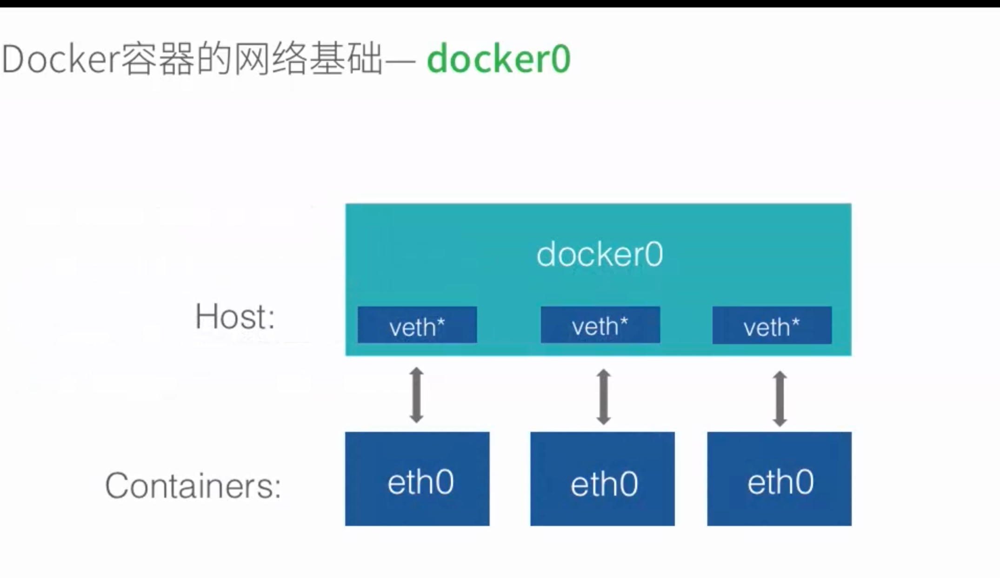
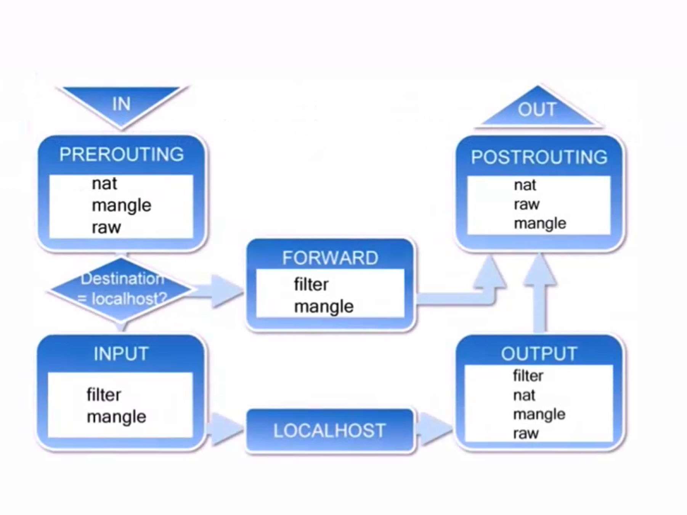

###安装网桥管理工具
```sudo apt install bridge-utils```

# 容器网络基础
> docker安装后虚拟网桥会为docker分配一个网卡
> 其他容器创建时就会在docker0上查 u 你就爱你一个interface接口 
> 用于容器链接docker0
* docker0 Linux 虚拟网桥  数据链路层 

> Linux 虚拟网桥的特点
> * 可以设置IP地址
> * 相当于拥有一个隐藏的虚拟网卡  
> 

## 修改docker0的地址
```$ sudo ifconfig docker0 192.169.200.1 netmask 255.255.255.0```
##自定义虚拟网桥
* 添加虚拟网桥
```cgo
$ sudo brctl addbr br0
$ sudo ifconfig br0 192.168.100.1 nermask 255.255.255.0
```
* 更改docker守护进程的启动配置
```
在/etc/default/docker中添加DOCKER_OPS的值
-b=br0

```
# 容器互联
* Docker默认情况是 允许所有的容器互联
--cc=true 默认两个容器间互联

*用户测试Docker 镜像Dockerfile：
```
# Container connection test
FROM ubuntu:16.04
MAINTAINER richiewen "richiewen8@gmail.com"
ADD sources.list /etc/apt/
RUN apt update
RUN apt install -y iputils-ping
RUN apt install -y net-tools
RUN apt install -y nginx
RUN apt install -y curl
EXPOSE 80
CMD /bin/bash
```

* ctrl+p+q 退出容器保持后台运行

* 再次进入一个正在运行的容器
* docker attach dreamy_ritchie或者用ID 
* docker attach cct1 重新附加

--link
```cgo
$ dcoker run --link=[CONTAINER_NAME]:[ALIAS] [IMAGE] [COMMOND]
```
例：
```cgo
$ docker run -it --name cct3 --link=cc1:webtest richiewen/cct
$ curl webtest
```

### iptables 操作命令
 * ```sudo iptable s -L -n``` 查看
 * ```sudo iptable -F``` 清空
  
###拒绝docker容器之间的互联
--icc=false
例：
```cgo
修改配置文件选项
重启服务
```

###允许特定容器见的链接
* docker守护进程的启动选项
--icc=false 
--iptables=true
--link 


##################################################################
# 容器与外部网络的链接
 * ip_forward
 * iptables
 * 允许端口映射访问 
 * 限制Ip访问 iptables


## ip_forward=true 系统默认允许流量转发  linux系统中的变量 系统是否会转发流量
```
# 查看ip_forward的值
$ sudo sysctl net.ipv4.conf.all.forwarding
```

## iptables
> iptables是与linux内核集成的包过滤防火墙系统，
> 几乎所有的linux发行版本都会包含iptables的功能。

##iptables 是怎么传递的



* table 
* chain
* rule
ACCEPT REJECT DROP


##filter表中包含的链
* INPUT 
* FORWARD
* OUTPUT

```
sudo iptables -t filter -L -n
sudo iptables -L -n
docker run -it -p 80 --name cct4 richiewen/cct4
docker port cct4
```

##阻止特定外部ip对容器的访问

> 禁止172.16.114.133访问特定容器 172.17.0.3
```sudo iptables -I DOCKER -s 172.16.114.133 -d 172.17.0.3 -p TCP  --dport 80 -j DROP```


