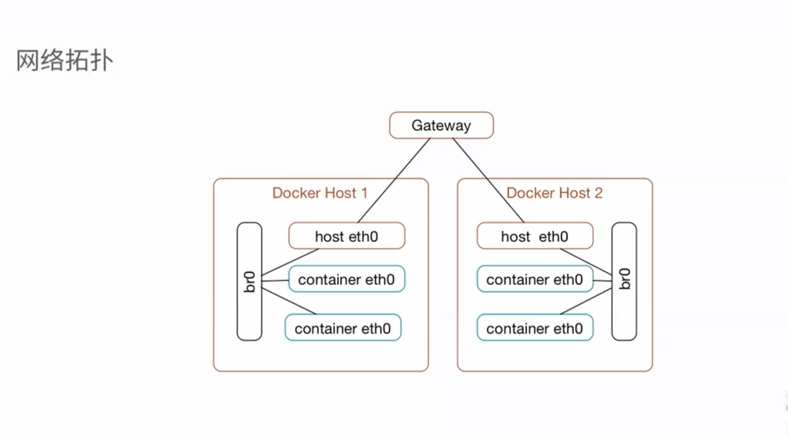
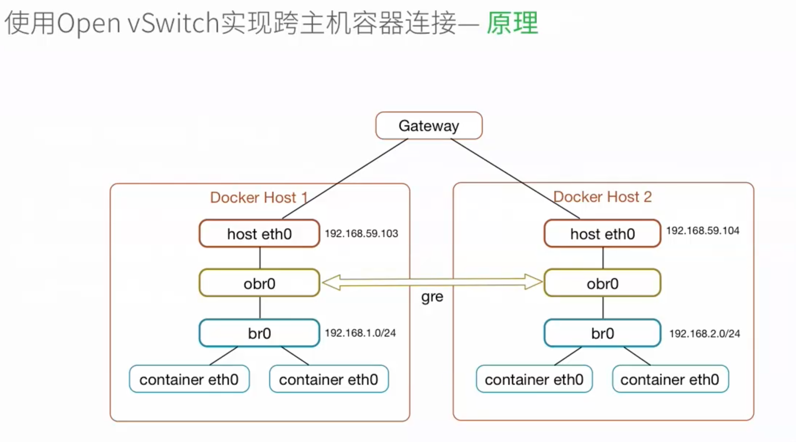
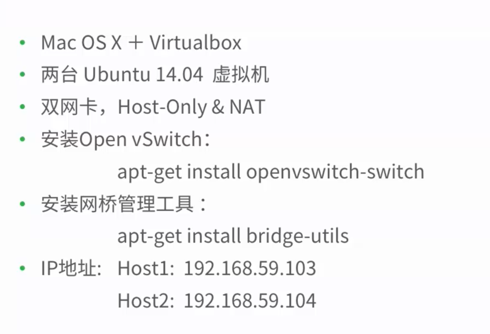

#跨主机连接方式

* 使用网桥实现跨主机容器连接
* 使用Open vSwitch实现跨主机容器连接
* 使用weave实现跨主机容器连接


##使用网桥实现跨主机容器连接


> 环境准备
* mac OSX
* 两台Ubuntu 14。04 虚拟机
* 安装网桥管理工具
    * apt install bridge-utils
* IP地址：
    * Host1 10.211.55.3
    * Host1 10.211.55.5
    
##修改 /etc/network/interfaces 文件
```
auto br0
iface br0 inet static
address 10.211.55.3
netmask 255.255.255.0
gateway 10.211.55.1
bridge_ports eth0
```
## 修改/etc/default/docker 文件
* -b 指定使用自定义网桥
    -b = br0
* --fixed-cidr 显示ip地址分配范围
    IP地址划分：
    Host1： 10.211.55.64/26
        地址范围：10.211.55.65～ 10.211.55.126
    Host2： 192.168.59.128/26
            地址范围：192.168.59.129～ 10.211.55.190

### 优点
   * 配置简单，不依赖第三方软件
### 缺点
   * 与主机在同网段，需要小心划分Ip地址
   * 需要有网段的控制权，在生产环境中不易实现
   * 不容易管理
   * 兼容不佳
##使用Open vSwitch实现跨主机容器连接
>什么是Open vSwitch
>Open vSwitch 是一个高质量的，多层虚拟交换机，使用开源apache2.0许可协议，由Nicira Networks开发，
>主要实现代码为可移植的C代码。他的目的是让大规模网络自动化可以通过编程扩展，同时仍然支持标准的管理接口协议
>(例如 NetFlow ,sFlow , SPAN,RSPAN,CLI,LACP,802.lag)

###原理


> 什么是GRE隧道


### 环境配置

###操作


#步骤演示
首先，在虚拟机“scvmu01”中添加ovs网桥：
```
$ sudo ovs-vsctl add-br obr0
$ 
$ sudo ovs-vsctl show
a48a5d4f-fa91-45c7-9ed2-35c711a6b2a7
    Bridge "obr0"
        Port "obr0"
            Interface "obr0"
                type: internal
    ovs_version: "2.5.0"
```
然后，我们添加gre接口并做相应的设置：
```
$ sudo ovs-vsctl set bridge obr0 datapath_type=netdev
$ sudo ovs-vsctl add-port obr0 gre0
$ sudo ovs-vsctl set interface gre0 type=gre options:remote_ip=192.168.56.102
$ sudo ovs-vsctl show
a48a5d4f-fa91-45c7-9ed2-35c711a6b2a7
    Bridge "obr0"
        Port "obr0"
            Interface "obr0"
                type: internal
        Port "gre0"
            Interface "gre0"
                type: gre
                options: {remote_ip="192.168.56.102"}
    ovs_version: "2.5.0"
```
> 注意：在添加“gre0”之前，我们需要执行sudo ovs-vsctl set bridge obr0 datapath_type=netdev命令完成一些设置，
> 不然会遇到ovs-vsctl: Error detected while setting up 'gre0'.这样的错误，有关此问题的参考文献： 
> [http://stackoverflow.com/questions/35689488/ovs-vsctl-error-detected-while-setting-up-bridge](http://stackoverflow.com/questions/35689488/ovs-vsctl-error-detected-while-setting-up-bridge)

接着，我们配置docker使用自定义虚拟网桥“br0”，并设定其IP地址为“192.168.11.1/24”：

```
$ sudo brctl addbr br0
$ sudo ifconfig br0 192.168.1.1 netmask 255.255.255.0
$ sudo cat  /etc/default/docker 
DOCKER_OPTS=" -b=br0 "
$sudo service docker restart
$ ps -ef | grep docker
  root      2999     1 21 21:59 ?        00:00:02 dockerd -H fd:// -b=br0
  schen     3138  2030  0 21:59 pts/0    00:00:00 grep --color=auto dockerd
```
再然后，我们为虚拟网桥“br0”添加ovs接口：
```
$ sudo brctl addif br0 obr0
$ sudo brctl show
bridge name     bridge id               STP enabled     interfaces
br0             8000.6a8ad01f8942       no              obr0
docker0         8000.024219816525       no
```
这时我们可以启动一个docker容器，用ping命令检查一下我们刚刚的配置，如果可以访问另一台虚拟机的IP地址，则说明gre隧道已经连接：
```
$ docker run -it richiewen/cct /bin/bash
root@eb62999e94a3:/# ping baidu.com
PING baidu.com (123.125.115.110) 56(84) bytes of data.
64 bytes from 123.125.115.110: icmp_seq=1 ttl=127 time=1.68 ms
64 bytes from 123.125.115.110: icmp_seq=2 ttl=127 time=1.69 ms
^C
--- baidu.com ping statistics ---
2 packets transmitted, 2 received, 0% packet loss, time 1002ms
rtt min/avg/max/mdev = 1.684/1.689/1.695/0.041 ms
root@eb62999e94a3:/# ping 172.16.114.133
PING 172.16.114.133 (172.16.114.133) 56(84) bytes of data.
64 bytes from 172.16.114.133: icmp_seq=1 ttl=63 time=0.557 ms
64 bytes from 172.16.114.133: icmp_seq=2 ttl=63 time=0.500 ms
64 bytes from 172.16.114.133: icmp_seq=3 ttl=63 time=0.592 ms
^C
--- 172.16.114.133 ping statistics ---
```
这时我们需要以同样的方法在“scvmu02”上进行配置，需要注意的是，我们会为Docker的自定义虚拟网桥“br0”指派不同的IP网段，即“192.168.2.1/24”：
```
~$ sudo ovs-vsctl add-br obr0
~$ 
~$ sudo ovs-vsctl set bridge obr0 datapath_type=netdev
~$ 
~$ sudo ovs-vsctl add-port obr0 gre0
~$ 
~$ sudo ovs-vsctl set interface gre0 type=gre options:remote_ip=192.168.56.101
~$ 
~$ sudo ovs-vsctl show
85fdc715-0db5-4415-9a42-66ded3e3b0dd
    Bridge "obr0"
        Port "gre0"
            Interface "gre0"
                type: gre
                options: {remote_ip="192.168.56.101"}
        Port "obr0"
            Interface "obr0"
                type: internal
    ovs_version: "2.5.0"
~$ 
~$ sudo brctl addbr br0
~$ 
~$ sudo ifconfig br0 192.168.12.1 netmask 255.255.255.0
~$ 
~$ sudo vi /etc/default/docker 
~$ 
~$ grep ^DOCKER_OPTS /etc/default/docker 
DOCKER_OPTS="-b=br0"
~$ 
~$ sudo service docker restart
~$ 
~$ ps -ef | grep dockerd
root      3083     1 22 22:18 ?        00:00:02 dockerd -H fd:// -b=br0
schen     3181  2069  0 22:18 pts/0    00:00:00 grep --color=auto dockerd
~$ 
~$ sudo brctl addif br0 obr0
~$ 
~$ sudo brctl show
bridge name     bridge id               STP enabled     interfaces
br0             8000.c6f4e057824e       no              obr0
docker0         8000.02428d6e09b7       no
```

##下面，我们需要为两台服务器添加到对方容器网段的路由：
```
~$ route
Kernel IP routing table
Destination     Gateway         Genmask         Flags Metric Ref    Use Iface
default         10.0.3.2        0.0.0.0         UG    0      0        0 enp0s8
10.0.3.0        *               255.255.255.0   U     0      0        0 enp0s8
172.17.0.0      *               255.255.0.0     U     0      0        0 docker0
192.168.11.0    *               255.255.255.0   U     0      0        0 br0
192.168.56.0    *               255.255.255.0   U     0      0        0 enp0s3
~$ 
~$ sudo ip route add 192.168.12.0/24 via 192.168.56.102 dev enp0s3
~$ 
~$ route
Kernel IP routing table
Destination     Gateway         Genmask         Flags Metric Ref    Use Iface
default         10.0.3.2        0.0.0.0         UG    0      0        0 enp0s8
10.0.3.0        *               255.255.255.0   U     0      0        0 enp0s8
172.17.0.0      *               255.255.0.0     U     0      0        0 docker0
192.168.11.0    *               255.255.255.0   U     0      0        0 br0
192.168.12.0    192.168.56.102  255.255.255.0   UG    0      0        0 enp0s3
192.168.56.0    *               255.255.255.0   U     0      0        0 enp0s3
~$ 
~$ route
Kernel IP routing table
Destination     Gateway         Genmask         Flags Metric Ref    Use Iface
default         10.0.3.2        0.0.0.0         UG    0      0        0 enp0s8
10.0.3.0        *               255.255.255.0   U     0      0        0 enp0s8
172.17.0.0      *               255.255.0.0     U     0      0        0 docker0
192.168.12.0    *               255.255.255.0   U     0      0        0 br0
192.168.56.0    *               255.255.255.0   U     0      0        0 enp0s3
~$ 
~$ sudo ip route add 192.168.11.0/24 via 192.168.56.101 dev enp0s3
~$ 
~$ route
Kernel IP routing table
Destination     Gateway         Genmask         Flags Metric Ref    Use Iface
default         10.0.3.2        0.0.0.0         UG    0      0        0 enp0s8
10.0.3.0        *               255.255.255.0   U     0      0        0 enp0s8
172.17.0.0      *               255.255.0.0     U     0      0        0 docker0
192.168.11.0    192.168.56.101  255.255.255.0   UG    0      0        0 enp0s3
192.168.12.0    *               255.255.255.0   U     0      0        0 br0
192.168.56.0    *               255.255.255.0   U     0      0        0 enp0s3
~$ 
```
##最后，我们来验证一下：
```
schen@scvmu01:~$ docker run -it shichen/cct
root@fc20e3581d46:/# 
root@fc20e3581d46:/# ifconfig
eth0      Link encap:Ethernet  HWaddr 02:42:c0:a8:0b:02  
          inet addr:192.168.11.2  Bcast:0.0.0.0  Mask:255.255.255.0
          inet6 addr: fe80::42:c0ff:fea8:b02/64 Scope:Link
          UP BROADCAST RUNNING MULTICAST  MTU:1500  Metric:1
          RX packets:8 errors:0 dropped:0 overruns:0 frame:0
          TX packets:8 errors:0 dropped:0 overruns:0 carrier:0
          collisions:0 txqueuelen:0 
          RX bytes:648 (648.0 B)  TX bytes:648 (648.0 B)

lo        Link encap:Local Loopback  
          inet addr:127.0.0.1  Mask:255.0.0.0
          inet6 addr: ::1/128 Scope:Host
          UP LOOPBACK RUNNING  MTU:65536  Metric:1
          RX packets:0 errors:0 dropped:0 overruns:0 frame:0
          TX packets:0 errors:0 dropped:0 overruns:0 carrier:0
          collisions:0 txqueuelen:1 
          RX bytes:0 (0.0 B)  TX bytes:0 (0.0 B)

root@fc20e3581d46:/# 
root@fc20e3581d46:/# ping 192.168.12.2
PING 192.168.12.2 (192.168.12.2) 56(84) bytes of data.
64 bytes from 192.168.12.2: icmp_seq=1 ttl=62 time=6.90 ms
64 bytes from 192.168.12.2: icmp_seq=2 ttl=62 time=0.915 ms
64 bytes from 192.168.12.2: icmp_seq=3 ttl=62 time=3.26 ms
64 bytes from 192.168.12.2: icmp_seq=4 ttl=62 time=7.69 ms
^C
--- 192.168.12.2 ping statistics ---
4 packets transmitted, 4 received, 0% packet loss, time 3012ms
rtt min/avg/max/mdev = 0.915/4.694/7.694/2.748 ms
root@fc20e3581d46:/# 

~$ docker run -it shichen/cct
root@18ba8916df6d:/# 
root@18ba8916df6d:/# ifconfig
eth0      Link encap:Ethernet  HWaddr 02:42:c0:a8:0c:02  
          inet addr:192.168.12.2  Bcast:0.0.0.0  Mask:255.255.255.0
          inet6 addr: fe80::42:c0ff:fea8:c02/64 Scope:Link
          UP BROADCAST RUNNING MULTICAST  MTU:1500  Metric:1
          RX packets:7 errors:0 dropped:0 overruns:0 frame:0
          TX packets:7 errors:0 dropped:0 overruns:0 carrier:0
          collisions:0 txqueuelen:0 
          RX bytes:578 (578.0 B)  TX bytes:578 (578.0 B)

lo        Link encap:Local Loopback  
          inet addr:127.0.0.1  Mask:255.0.0.0
          inet6 addr: ::1/128 Scope:Host
          UP LOOPBACK RUNNING  MTU:65536  Metric:1
          RX packets:0 errors:0 dropped:0 overruns:0 frame:0
          TX packets:0 errors:0 dropped:0 overruns:0 carrier:0
          collisions:0 txqueuelen:1 
          RX bytes:0 (0.0 B)  TX bytes:0 (0.0 B)

root@18ba8916df6d:/# 
root@18ba8916df6d:/# ping 192.168.11.2
PING 192.168.11.2 (192.168.11.2) 56(84) bytes of data.
64 bytes from 192.168.11.2: icmp_seq=1 ttl=62 time=5.66 ms
64 bytes from 192.168.11.2: icmp_seq=2 ttl=62 time=1.83 ms
64 bytes from 192.168.11.2: icmp_seq=3 ttl=62 time=4.35 ms
64 bytes from 192.168.11.2: icmp_seq=4 ttl=62 time=2.17 ms
^C
--- 192.168.11.2 ping statistics ---
4 packets transmitted, 4 received, 0% packet loss, time 3009ms
rtt min/avg/max/mdev = 1.832/3.505/5.660/1.576 ms
root@18ba8916df6d:/# 
```

> 对于这个实验，作者保留个人观点，认为视频中存在一个问题，那就是即使没有ovs网桥，只要配置了路由表，容器就是可以相互连接的，而作者实际做这个实验的时候，
> 流量也并没有通过ovs网桥，而是经过“enp0s3”网卡。由于并不影响演示，所以作者还是把文章发了出来，这是作者在本文中唯一没有解决的问题。作者也考虑了各种
> 可能，但是始终没有弄明白，还请高人指点！
 
> 小结
> 我们实现了使用Open vSwitch进行跨主机的容器连接，虽然在配置上比上一章节中的方法稍微复杂了一点，但是它可以有效地跨越网络中的障碍来实现容器之间的互
> 联。在实际的生产环境中，我们可以使用shell脚本将这一系列的操作自动化，当然我们也可以使用一些现成的工具来帮我们简化这一过程，下一章节我们将介绍如何
> 使用weave进行跨主机的容器连接。
