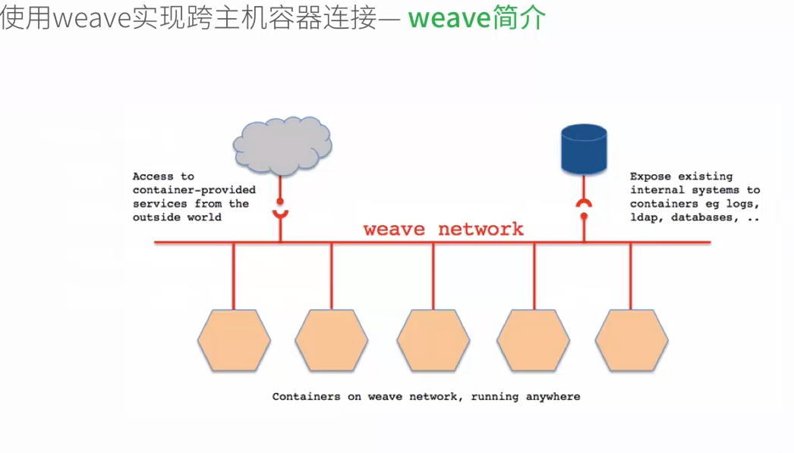

# 使用weave实现跨主机容器连接
##weave简介
    Weave是由Zett.io公司开发的，它能够创建一个虚拟网络，用于连接部署在多台主机上的Docker容器，这样容器就像被接入了同一个网络交换机，那些使用网络
    的应用程序不必去配置端口映射和链接等信息。外部设备能够访问Weave网络上的应用程序容器所提供的服务，同时已有的内部系统也能够暴露到应用程序容器上。
    Weave能够穿透防火墙并运行在部分连接的网络上，另外，Weave的通信支持加密，所以用户可以从一个不受信任的网络连接到主机。



##环境准备
    为了演示我们需要准备如下环境： 
 *  Windows + VirtualBox 
 *  两台Ubuntu 16.04虚拟机，主机名为“scvmu01”和“scvmu02” 
 * 虚拟机安装双网卡，“Host-Only”和“NAT” 
 *  两台虚拟机的“Host-Only”网卡IP地址为“192.168.56.101”和“192.168.56.102”

操作
使用weave实现Docker容器跨主机连接需要如下操作： 
*  安装weave 
*  启动weave（weave launch） 
*  连接不同主机 
*  通过weave启动容器

步骤演示
首先，我们从github网站下载二进制文件进行安装：
```
schen@scvmu01:~$ sudo wget -O /usr/local/bin/weave https://raw.githubusercontent.com/zettio/weave/master/weave
--2016-11-09 00:00:29--  https://raw.githubusercontent.com/zettio/weave/master/weave
Resolving raw.githubusercontent.com (raw.githubusercontent.com)... 151.101.100.133
Connecting to raw.githubusercontent.com (raw.githubusercontent.com)|151.101.100.133|:443... connected.
HTTP request sent, awaiting response... 200 OK
Length: 76666 (75K) [text/plain]
Saving to: "usr/local/bin/weave"

/usr/local/bin/weave            100%[====================================================>]  74.87K   154KB/s    in 0.5s    

2016-11-09 00:00:32 (154 KB/s) - "usr/local/bin/weave" saved [76666/76666]

schen@scvmu01:~$ 
schen@scvmu01:~$ sudo chmod a+x /usr/local/bin/weave
schen@scvmu01:~$ 
```
## 然后，我们来启动weave，成功后我们可以通过docker ps命令查看到weave相关的容器：
```
    schen@scvmu01:~$ weave launch
    schen@scvmu01:~$ 
    schen@scvmu01:~$ docker ps
    CONTAINER ID        IMAGE                         COMMAND                  CREATED             STATUS              PORTS               NAMES
    ac1285c84aa0        weaveworks/plugin:latest      "/home/weave/plugin"     11 seconds ago      Up 7 seconds                            weaveplugin
    e751dbd83403        weaveworks/weaveexec:latest   "/home/weave/weavepro"   16 seconds ago      Up 14 seconds                           weaveproxy
    5de147306722        weaveworks/weave:latest       "/home/weave/weaver -"   27 seconds ago      Up 25 seconds                           weave
```
##下面我们就以同样的方式在“scvmu02”上进行操作，但是在执行weave launch命令时，我们需要指定“scvmu01”的IP地址：
```schen@scvmu02:~$ weave launch 192.168.56.101
   schen@scvmu02:~$ 
   schen@scvmu02:~$ docker ps
   CONTAINER ID        IMAGE                         COMMAND                  CREATED             STATUS              PORTS               NAMES
   d6a9e900dffa        weaveworks/plugin:latest      "/home/weave/plugin"     9 seconds ago       Up 5 seconds                            weaveplugin
   24df2d250520        weaveworks/weaveexec:latest   "/home/weave/weavepro"   15 seconds ago      Up 12 seconds                           weaveproxy
   4d22a8f04731        weaveworks/weave:latest       "/home/weave/weaver -"   26 seconds ago      Up 24 seconds                           weave
   schen@scvmu02:~$ 
```
> 到这里我们就可以通过weave run命令启动我们自己的容器了，从命令执行的结果来看，weave run命令显然是通过调用docker run命令完成任务的。而具体说来，它的完整格式应该是这样的：
> weave run [ip address] [OPTIONS] IMAGE [COMMAND] [ARG...]
> 这里的“ip address”，就是我们要为容器分配的IP地址，而这个IP地址将由weave负责维护。下面，我们就来启动一个容器：
```
  schen@scvmu02:~$ weave run 192.168.1.20/24 --name wet -it shichen/cct /bin/bash
  19f4548c694f5f4148aa2912a92696554b96fea20954931479057584e0b94578
  schen@scvmu02:~$ 
  schen@scvmu02:~$ docker attach wet
  root@wet:/# 
  root@wet:/# ifconfig
  eth0      Link encap:Ethernet  HWaddr 02:42:ac:11:00:03  
            inet addr:172.17.0.3  Bcast:0.0.0.0  Mask:255.255.0.0
            inet6 addr: fe80::42:acff:fe11:3/64 Scope:Link
            UP BROADCAST RUNNING MULTICAST  MTU:1500  Metric:1
            RX packets:8 errors:0 dropped:0 overruns:0 frame:0
            TX packets:8 errors:0 dropped:0 overruns:0 carrier:0
            collisions:0 txqueuelen:0 
            RX bytes:648 (648.0 B)  TX bytes:648 (648.0 B)
  
  ethwe     Link encap:Ethernet  HWaddr c6:b3:98:7f:9d:a8  
            inet addr:192.168.1.20  Bcast:0.0.0.0  Mask:255.255.255.0
            inet6 addr: fe80::c4b3:98ff:fe7f:9da8/64 Scope:Link
            UP BROADCAST RUNNING MULTICAST  MTU:1410  Metric:1
            RX packets:8 errors:0 dropped:0 overruns:0 frame:0
            TX packets:9 errors:0 dropped:0 overruns:0 carrier:0
            collisions:0 txqueuelen:0 
            RX bytes:648 (648.0 B)  TX bytes:690 (690.0 B)
  
  lo        Link encap:Local Loopback  
            inet addr:127.0.0.1  Mask:255.0.0.0
            inet6 addr: ::1/128 Scope:Host
            UP LOOPBACK RUNNING  MTU:65536  Metric:1
            RX packets:0 errors:0 dropped:0 overruns:0 frame:0
            TX packets:0 errors:0 dropped:0 overruns:0 carrier:0
            collisions:0 txqueuelen:1 
            RX bytes:0 (0.0 B)  TX bytes:0 (0.0 B)
  
  root@wet:/#
```
## 我们注意到，容器中多了一个名为“ethwe”的虚拟网卡，它的IP地址就是我们刚才指定的“192.168.1.20/24”。接下来，我们回到“scvmu01”上，以同样的方法启动一个容器：

```
schen@scvmu01:~$ id=$(weave run 192.168.1.10/24 -it shichen/cct /bin/bash)
schen@scvmu01:~$ 
schen@scvmu01:~$ docker attach $id
root@0dcba116b8b6:/# 
root@0dcba116b8b6:/# ifconfig 
eth0      Link encap:Ethernet  HWaddr 02:42:ac:11:00:02  
          inet addr:172.17.0.2  Bcast:0.0.0.0  Mask:255.255.0.0
          inet6 addr: fe80::42:acff:fe11:2/64 Scope:Link
          UP BROADCAST RUNNING MULTICAST  MTU:1500  Metric:1
          RX packets:16 errors:0 dropped:0 overruns:0 frame:0
          TX packets:8 errors:0 dropped:0 overruns:0 carrier:0
          collisions:0 txqueuelen:0 
          RX bytes:1296 (1.2 KB)  TX bytes:648 (648.0 B)

ethwe     Link encap:Ethernet  HWaddr 6e:1c:bb:3b:42:85  
          inet addr:192.168.1.10  Bcast:0.0.0.0  Mask:255.255.255.0
          inet6 addr: fe80::6c1c:bbff:fe3b:4285/64 Scope:Link
          UP BROADCAST RUNNING MULTICAST  MTU:1410  Metric:1
          RX packets:8 errors:0 dropped:0 overruns:0 frame:0
          TX packets:9 errors:0 dropped:0 overruns:0 carrier:0
          collisions:0 txqueuelen:0 
          RX bytes:648 (648.0 B)  TX bytes:690 (690.0 B)

lo        Link encap:Local Loopback  
          inet addr:127.0.0.1  Mask:255.0.0.0
          inet6 addr: ::1/128 Scope:Host
          UP LOOPBACK RUNNING  MTU:65536  Metric:1
          RX packets:0 errors:0 dropped:0 overruns:0 frame:0
          TX packets:0 errors:0 dropped:0 overruns:0 carrier:0
          collisions:0 txqueuelen:1 
          RX bytes:0 (0.0 B)  TX bytes:0 (0.0 B)

root@0dcba116b8b6:/# 
```

>  注意这次我们并没有为容器指定名字，而是使用变量“id”保存了weave run的返回值，即新启动的容器ID，这个技巧在编写脚本程序时会变得非常有用。
> 同样，这个容器中也有一个名为“ethwe”的虚拟网卡，它的IP地址是“192.168.1.10/24”。下面，我们就来验证一下：

```
    root@0dcba116b8b6:/# ping 192.168 .1.20
    PING 192.168.1.20 (192.168.1.20) 56(84) bytes of data.
    64 bytes from 192.168.1.20: icmp_seq=1 ttl=64 time=41.7 ms
    64 bytes from 192.168.1.20: icmp_seq=2 ttl=64 time=2.73 ms
    64 bytes from 192.168.1.20: icmp_seq=3 ttl=64 time=2.26 ms
    64 bytes from 192.168.1.20: icmp_seq=4 ttl=64 time=1.94 ms
    ^C
    --- 192.168.1.20 ping statistics ---
    4 packets transmitted, 4 received, 0% packet loss, time 3007ms
    rtt min/avg/max/mdev = 1.946/12.175/41.753/17.079 ms
    root@0dcba116b8b6:/# 
```
> 反之亦然：
```
    root@wet:/# ping 192.168.1.10
    PING 192.168.1.10 (192.168.1.10) 56(84) bytes of data.
    64 bytes from 192.168.1.10: icmp_seq=1 ttl=64 time=3.32 ms
    64 bytes from 192.168.1.10: icmp_seq=2 ttl=64 time=1.25 ms
    64 bytes from 192.168.1.10: icmp_seq=3 ttl=64 time=1.43 ms
    64 bytes from 192.168.1.10: icmp_seq=4 ttl=64 time=2.25 ms
    ^C
    --- 192.168.1.10 ping statistics ---
    4 packets transmitted, 4 received, 0% packet loss, time 3016ms
    rtt min/avg/max/mdev = 1.255/2.069/3.329/0.818 ms
    root@wet:/# 
```
#小结
> 我们发现，通过weave我们可以非常轻松地为容器分配IP地址并完成网段的划分，从而将不同主机上的容器划分到不同的网段中。如果说上一章节中我们通过OVS实现
> 了跨主机的容器连接，那么这一章节中，我们通过weave不但实现了跨主机的容器连接，还可以通过为容器划分不同的网段，实现对容器之间连接的控制。

