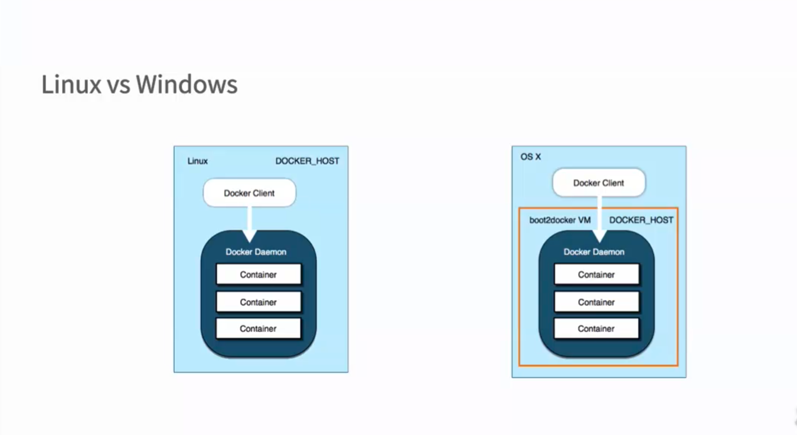
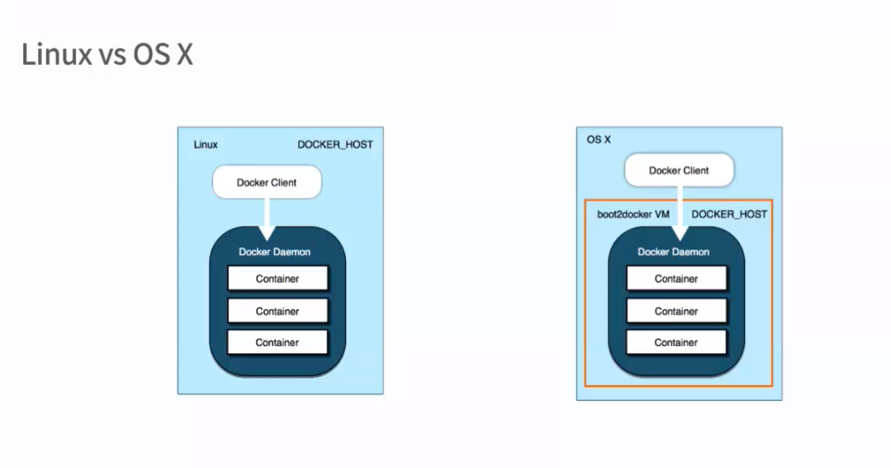

# Ubuntu中安装Docker
### 安装Docker-CE支持的Ubuntu版本
   * Bionic 18.04 (LTS)
   * Xenial 16.04 (LTS)
   * Trusty 14.04 (LTS) 
   
### 安装前检查

   * 内核版本
     ```uname -a```
   * 检查Device Mapper 是否存在
     ```ls -l /sys/class/misc/divice-mapper```
     
###安装Ubuntu维护的版本
   * $sudo apt install docker.io
   * source /etc/bash_completion.d/docker.io
### 安装docker维护的版本
* 检查apt的https支持查看/usr/lib/apt/methods/https文件是否存在，运行安装命令
    ```
   $apt update
   $apt install -y apt-transport-https
    ```
* 添加Docker的APT仓库
    ```
    $echo deb https://get.docker.com/ubuntu docker main>/etc/apt/sources.list.d/docker.list
    ```
    
* 添加仓库的key
    ```
    $apt-key adv --keyserver hkp://p80.pool.sks-keyservers.net:80 --recv-keys 36A1D7869245C8950F966E92D8576A8BA88D21E9
    ```
*  安装
    ```
    $apt update
    $apt install -y lxc-docker
    ```

###简易安装方式
   * ```sudo apt install -y curl``` 
   * ```curl -sSl https://get.docker.com/ubunut/|sudo sh``` 
 
### 使用非root用户
   * ```$sudo groupadd docker```
   * ```$sudo gpasswd -a ${USER} docker```
   * ```$sudo service docker restart```


#Docker运行环境
   * Linux容器技术
   * 操作系统级别的虚拟化
   * 依赖于Linux内核的namespace和Cgroups


##Boot2Docker Linux ISO
   * Boot2Docker Linux ISO
   * Virtualbox
   * MySY-git
   * 管理工具
   
 
 
 
###系统要求
   * Windows 8
   * Windows 7
   * 以前的版本
   
###下载安装Boot2Docke
   * 访问github的Boot2Docker 
   [Boot2Docker](https://github.com/boot2docker/boot2docker) |
   [Boot2Docker](https://download.docker.com/win/stable/Docker%20for%20Windows%20Installer.exe)
   * 下载docker-install.exe
   * 安装docker-install.exe
  
# 微软对Docker的支持
  * Windows Azure中Docker惊喜那个以及Docker仓库
  * Windows Server 的下一个版本 2016
  * Docker Windows CLI 
  
  
#在OSX中安装Docker
     


###系统要求
   * OSX 10。6 "SnowLeopard"之后的系统
###下载安装Boot2Docke
  * 访问github的Boot2Docker 
  [Boot2Docker](https://github.com/boot2docker/boot2docker) |
  [Boot2Docker](https://download.docker.com/mac/stable/Docker.dmg)
  * 下载Boot2Docker-1.5.0.pkg
  * 安装Boot2Docker-1.5.0.pkg

   
