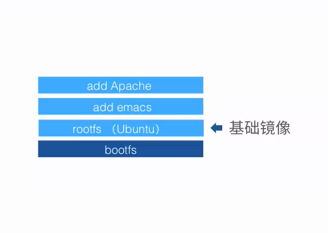
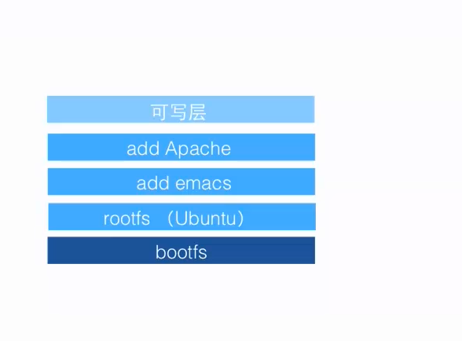
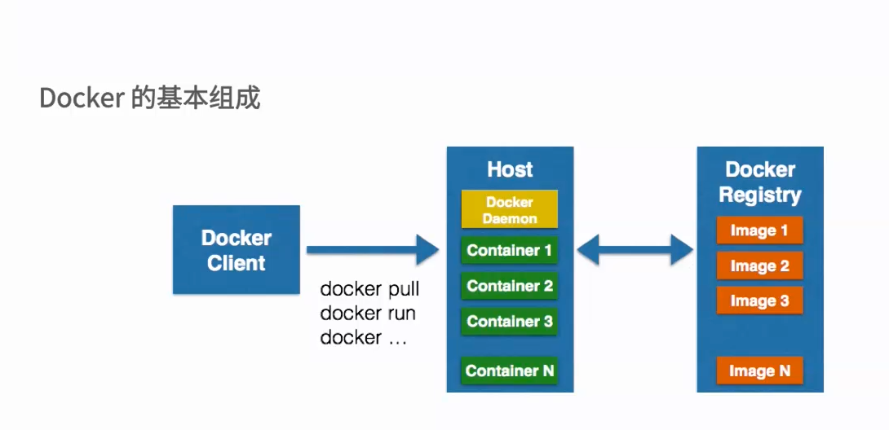

# Docker 基本组成

* client
* daemon
* image
* Container
* registry

## docker client/daemon
* C/S结构
本地/远程

## Docker Image
* 容器的基石
* 层叠的只读文件系统
* 联合加载（union mount）


## docker Container

* 通过镜像启动  在镜像顶部加载一个可写层
* 启动执行阶段   
    * 执行阶段的所有操作在可写成执行，初始docker读写层是空的，当文件系统发生变化的时候，这些变化都会应用到可写层
    * 例 ；当修改一个文件的时候，这个文件首先会从可写成下面的只读层复制到可写层，该文件的只读版本依然存在，但是被
    可写层中的文
件副本所隐藏
* 写时复制（copy on write） 每个只读镜像层永远是只读的，以后永远不会变化

    * 当创建一个容器时docker回构建一个镜像栈，在栈的最顶端添加可写层，可写成加上下面的只读层以及配置数据就构成了容器

# docker 仓库
* 公有
* 私有
* docker Hub





##从仓库查找镜像
```
    docker search tutorial
```
###从仓库下载镜像
```
    docker pull learn/tutorial
```

###启动一个容器
```
    docker run learn/tutorial echo "hello world"
```

### 在容器中安装ping命令
```
    docker run learn/tutorial apt install -y ping
```
### 查看有哪些active的容器
```
    docker ps
```

### 提交容器  相当于创建了一个新的镜像
```
    docker commit 容器id learn/ping
```
### 使用提交的镜像
```
    docker run learn/ping ping www.baidu.com
```
###查看运行中的容器信息
```
    docker inspect 容器id 
```
### 查看有哪些镜像
```
    docker images
```
### 将新镜像保存到远程仓库
```
    docker push learn/ping
```

# Docker依赖的Linux内核特性
* Namespaces命名空间
* Control groups (cgroups)控制组

##Namespaces命名空间

* 编程语言
    * 封装==》代码隔离
* 操作系统
    * 系统资源的隔离 
    * 进程、网络、文件系统。。。轻量级虚拟化服务
### docker namespaces
   * PID（Process ID） 进程隔离
   * NET（NetWork） 管理网络接口
   * IPC（InterProcess Communication）管理跨进城通信的访问
   * MNT（Mount）管理挂载点
   * UTS（Unix Timesharing System） 隔离内核和版本标识
## ontrol groups (cgroups)控制组
   * 分类资源
   * 来源于google
   * Linux kernel 2.6.24@2007
### cgroups  提供了哪些功能呢
   * 资源限制
   * 优先级设定
   * 资源计量
   * 资源控制
   
#Docker容器的能力
   * 文件系统隔离： 每个容器都有自己的root文件系统
   * 进程隔离：每个容积都运行在自己的进程环境中
   * 网络隔离： 容器见的虚拟网络接口和IP地址都是分开的
   * 资源隔离和分组： 使用cgroups将CPU和内存之类的资源独立分配给每个Docker容器


  
