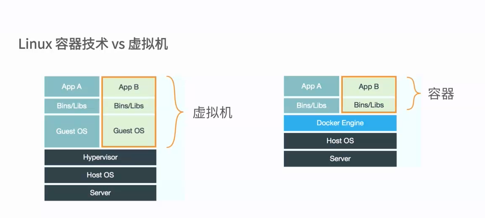

# docker 简介

##什么是容器？
* 一种虚拟化的方案
* 操作系统级别的虚拟化
* 只能运行相同或相似内核的操作系统
* 依赖与Linux内核性能： Namespace和Cgroups（Control Group）

Linux 容器技术vs虚拟机

## 什么是Docker？
* 将应用程序部署到容器
* Go语言开源引擎 GitHub: [Docker](https://github.com/moby/moby)
* 2013年初 dotCloud
* 基于Apache 2.0 开源授权协议发行

## docker 的目标
* 提供简单轻量的建模方式
* 职责的逻辑分离
* 快速高效的开发周期
* 鼓励使用面向服务的架构  高内聚 低耦合 单一任务

##docker的使用场景
* 使用docker容器开发、测试、部署服务
* 创建隔离的容器环境
* 搭建测试环境
* 构架多用户平台服务（Pass）基础设施
* 提供软件即服务（Saas）应用程序
* 高性能，超大规模的宿主机部署 
aws 等公有云服务都提供了对docker的支持，是开发者可以利用云平台搭建Saas和Pass服务
使用open stack将Pass和Sass结合，是的open stack在云计算领域有着非常广阔的领域

 
