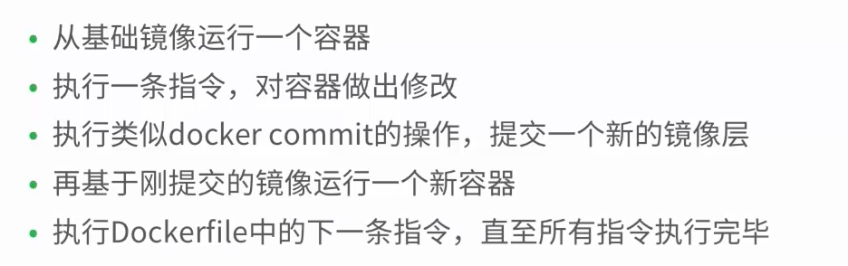

# 指令格式

# Comment
 MAINTAINER argument

* FROM 
    * FROM <image>
    * FROM <image>:<tag>  
    * 已经存在的镜像
    * 基础镜像
    * 必须是第一条非注释指令
* MAINTAINER
    * 指定作者属性
* RUN
    * 指定当前镜像中运行的命令
    * RUN <command> (shell模式)  ```/bin/sh -c command   RUN echo hello```
    * RUN ["executable","param1","param2"] (exec模式)
    
* EXPOSE
     * EXPOSE <port> [ <port>...]
     * 指定运行镜像的容器使用的端口
* CMD 
    * 提供容器运行的默认命令  RUN中的指令会覆盖
    
    
### 使用Dockerfile
```
# First Dockerfile
FROM ubuntu:14.04
MAINTAINER richiewen "richiewen8@gmail,.com"
RUN apt update
RUN apt install -y nginx
EXPOSE 80
CMD ["/user/sbin/nginx","-g","daemon off;"]
```

* ENTERYPOINT --entrypoint
    ENTERYPOINT 指定命令 CMD 指定参数
    
```
# First Dockerfile
FROM ubuntu:14.04
MAINTAINER richiewen "richiewen8@gmail,.com"
RUN apt update
RUN apt install -y nginx
EXPOSE 80
ENTERYPOINT ["/user/sbin/nginx"]
CMD ["-g","daemon off;"]
```

* ADD vs.COPY
    * ADD 包含类似tar的解压缩功能
    * 如果单纯复制文件，Docker推荐使用COPY
```
# First Dockerfile
FROM ubuntu:14.04
MAINTAINER richiewen "richiewen8@gmail,.com"
RUN apt update
RUN apt install -y nginx
COPY index.html /usr/sahre/nginx/html/
EXPOSE 80
CMD ["/user/sbin/nginx","-g","daemon off;"]
```
* VOLUME["/data""]

* WORKDIR
    * /path/to/workdir
* ENV
    ENV REFRESH_DATE2018-11-19
* USER daemon
    * 以什么身份用户容器
    * USER nginx
    
```cgo
USER user          USER uid
USER user:group    USER uid:gid
USER user:gid      USER uid:group
```
    
* ONBUILD [INSTRUCTION]  当一这个镜像创建新镜像的时候触发
    * 为镜像添加触发器
    * 当一个镜像被其他镜像作为基础镜像时执行
    * 会在构架过程中插入指令


```
# First Dockerfile
FROM ubuntu:14.04
MAINTAINER richiewen "richiewen8@gmail,.com"
RUN apt update
RUN apt install -y nginx
ONBUILD index.html /usr/sahre/nginx/html/
EXPOSE 80
CMD ["/user/sbin/nginx","-g","daemon off;"]
```


# Dockerfile 构建过程



# 构建缓存
* 不使用缓存
```$docker build --no-cache```
# 构建过程
```$docker history```