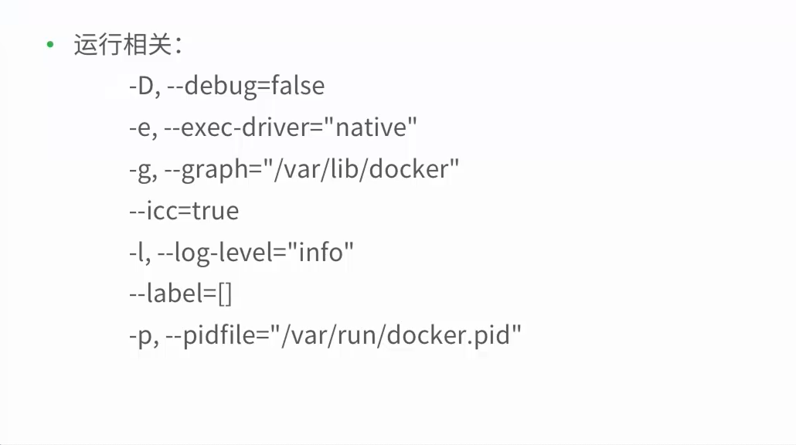
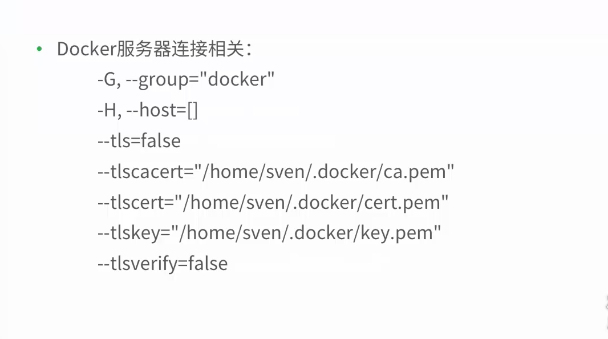
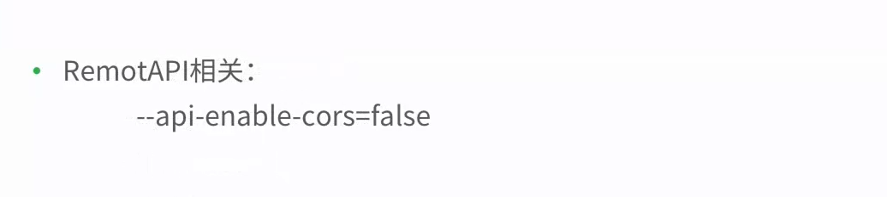
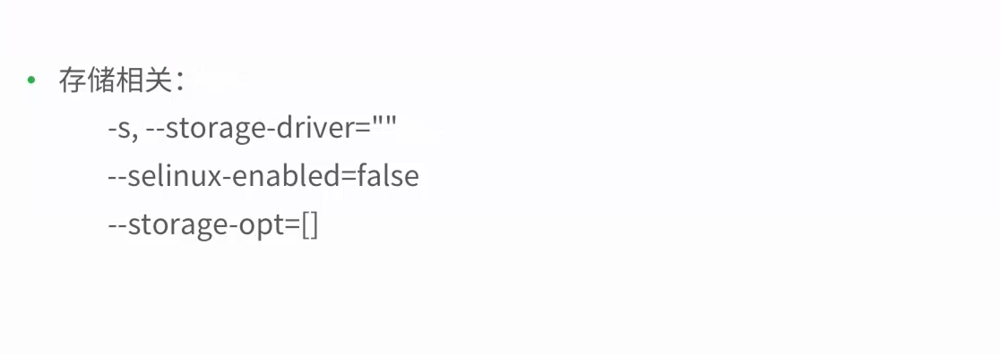
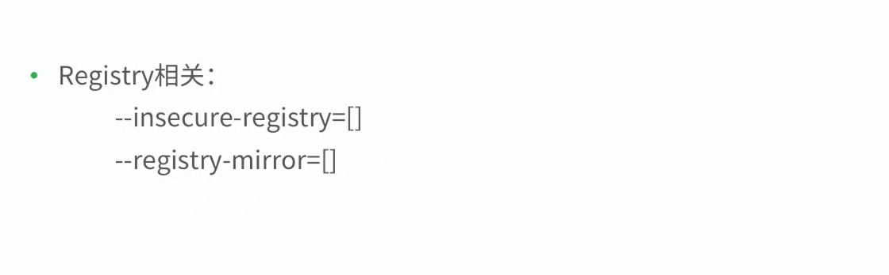
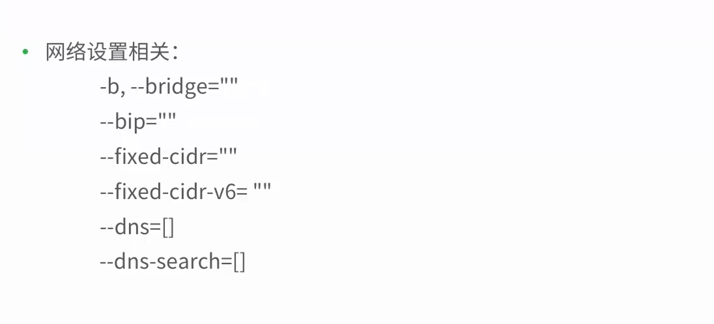

* docker -d [OPTION]









* docker 启动配置文件
    ```/etc/default/docker```


# docker的远程访问

-H选项
* DOCKER——HOST 环境变量


# 查看和删除镜像

* docker images
- a -- all=false  显示所有镜像  不显示中间层镜像
-f filter=[]  显示时候的过滤条件
--no-trunc =false   不使用截断的形式显示数据
-q --quiet =false  只显示镜像的唯一id


# 仓库

## 查看镜像的详细信息

docker inspect [OPTIONS] CONTAINER|IMAGE [CONTAINER|IMAGE]
-f --format

# 删除镜像
docker rmi -f 强制删除 -no-prune 保留被打标签的父镜像


### 列出镜像
$## docker images
### 镜像标签和仓库
$ Repository & Tag
### 查看镜像详细信息
$ docker inspect
### 删除镜像
$ docker rmi


### 如何查找镜像
* [docker hub](https://hub.docker.com)

* docker search [OPTION] TERM
```
Options:
  --automated=fale Only show automated builds
  --no-trunc=false  Don't cruncate output
  -s , --stars=0 Only displays with at least x stars
```      
最多返回25个镜像

### 拉去镜像
docker pull [OPTIONS] NAME[:TAG]
### 上传镜像
docker push  NAME[:TAG]

## 构建镜像
### docker commit  通过容器构建
-a --author="" 作者
-m --message="" 提交信息
-p --pause=true  正常情况会暂停容器
docker build  通过dockerfile文件构建

### 使用Dockerfile
```
# First Dockerfile
FROM ubuntu:14.04
MAINTAINER richiewen "richiewen8@gmail,.com"
RUN apt update
RUN apt install -y nginx
EXPOSE 80
```
### Build命令
```
docker build [OPTIONS] PATH | URL| -
    --force-rm=false
    --no-cache=false
    --pull=false,
    -q,--quiet=false,
    --rm=true
    -t,tag=""  指定构建镜像的tag
```


